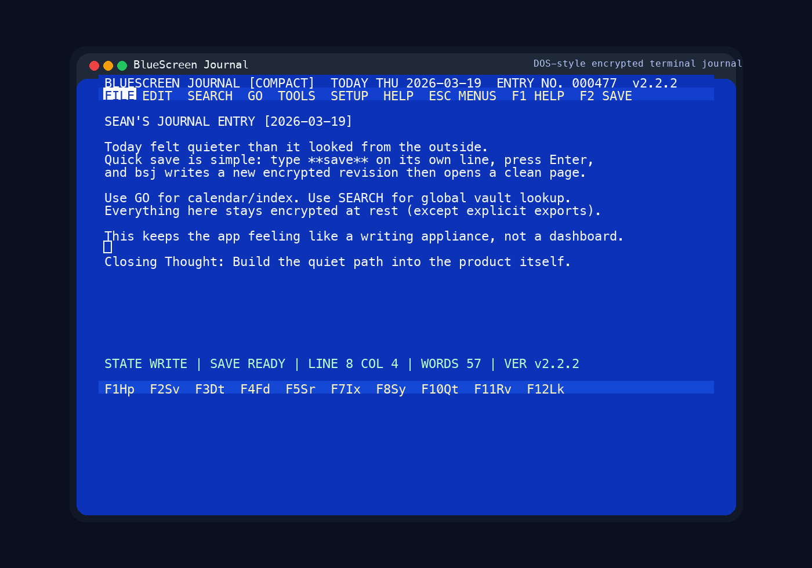
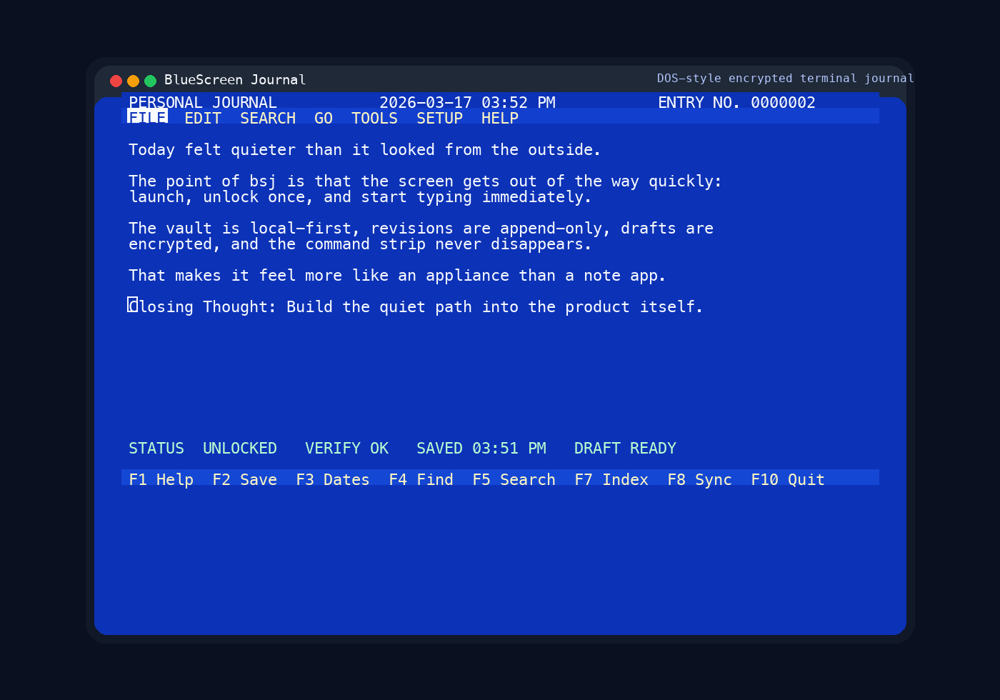
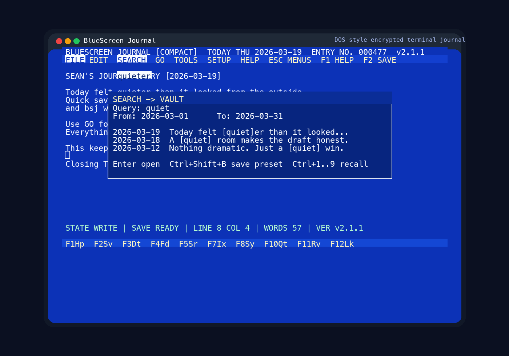
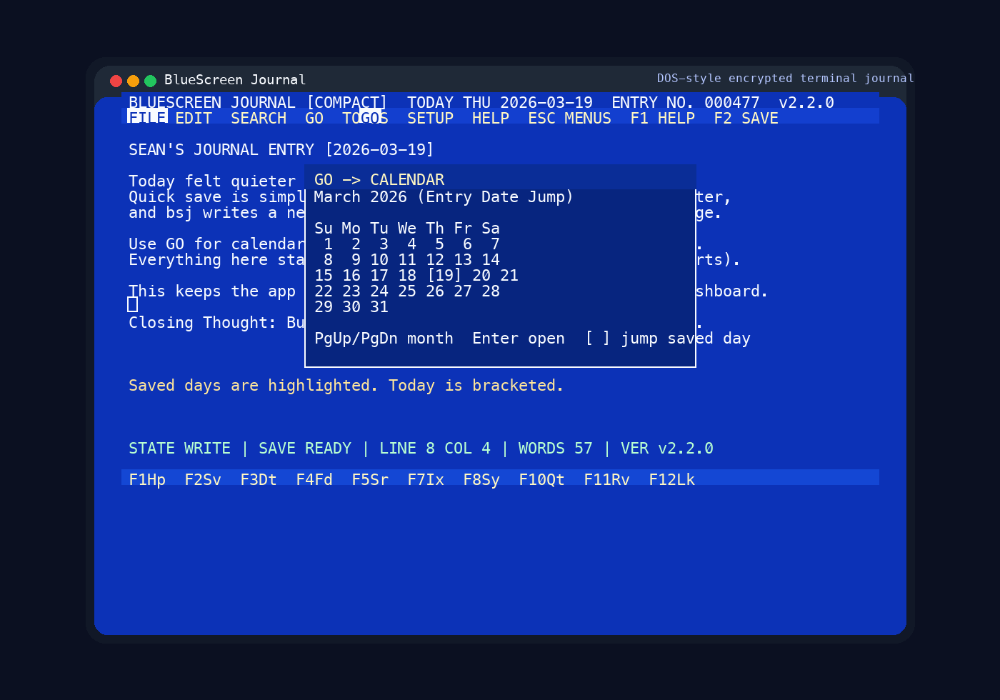
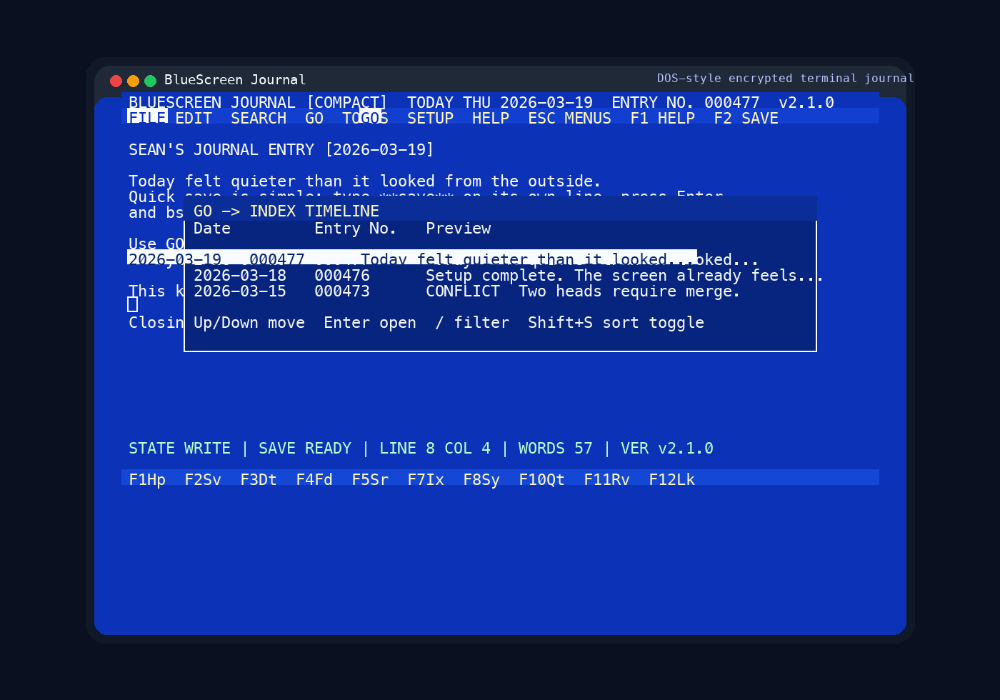

# bsj

[](https://github.com/Awassee/bluescreenjournal/releases/latest)
[](LICENSE)
[](docs/DATASHEET.md)
[](docs/PRODUCT_GUIDE.md)
[](docs/START_HERE.md)

BlueScreen Journal is an encrypted, local-first journaling app for macOS terminals.
It is built for people who want the focused feel of an old DOS word processor, but with modern safety features: encrypted storage, append-only history, encrypted drafts, encrypted backups, and encrypted sync.

The product goal is narrow on purpose: launch, unlock once, and start writing immediately in a blue-screen full-screen editor that feels like a dedicated writing appliance.



## At a glance

- write-first terminal experience with a consistent DOS-style workspace
- encrypted vault, drafts, backups, and sync blobs
- append-only revisions and integrity verification
- menu-driven discoverability so new users are not blocked by key memorization
- local-first design with optional folder/S3/WebDAV encrypted sync
- optional AI summary and reflective coach mode (off by default)

## New in v1.2.0

- added a menu-reachable First-Run Tour under `HELP` with a concise 2-minute guided workflow
- added `TOOLS -> Journal Health` for fast trust checks (lock state, save state, integrity, backups, conflicts, sync target)
- added a repeat-run stability gate script and wired it into QA and release workflows
- refreshed release/docs surfaces to publish `v1.2.0` as the current stable

## Screenshots

| Writing View | Search View |
| --- | --- |
|  |  |
| Full-screen editor with persistent menu and command strip. | Global search with filters and quick-open results. |
| Calendar View | Index View |
|  |  |
| Month grid with saved-day highlights and fast date jump. | Real timeline with entry previews and conflict indicators. |

## Why bsj exists

Most journaling tools force one of two bad tradeoffs:

- modern note apps give you sync and search, but pull you into a GUI workflow full of chrome
- plaintext file workflows keep control local, but leave sensitive writing exposed on disk and in cloud folders

bsj is designed to avoid both.

It gives you:

- a keyboard-only writing flow with a persistent command strip and nostalgic `80x25` screen discipline
- encrypted-at-rest journal content, drafts, backups, and sync blobs
- append-only revisions so intentional saves create history instead of overwriting it
- menu-driven discovery so the app still feels learnable without memorizing every function key
- real editor commands for line movement, stamps, and structural writing work
- in-product review and admin surfaces so daily use stays inside the TUI

## Product snapshot

- platform: macOS
- interface: full-screen Rust TUI in Terminal.app and iTerm2
- visual direction: royal-blue background, white monospaced text, classic DOS-era workspace
- storage model: local-first encrypted vault on disk
- sync model: encrypted folder sync, plus S3 and WebDAV backends
- history model: append-only revisions plus encrypted per-date autosave drafts
- search model: in-memory index after unlock, with no plaintext search index on disk

## Documentation by task

| Goal | Read this first |
| --- | --- |
| Install and get writing quickly | [README install section](#turnkey-install), [Quickstart](docs/QUICKSTART.md), [Setup Guide](docs/SETUP_GUIDE.md) |
| Understand product capabilities | [Product Guide](docs/PRODUCT_GUIDE.md), [Datasheet](docs/DATASHEET.md), [Compare](docs/COMPARE.md) |
| Resolve install/runtime issues | [Troubleshooting](docs/TROUBLESHOOTING.md), [Terminal Guide](docs/TERMINAL_GUIDE.md), [Support](SUPPORT.md) |
| Operate sync/backup safely | [Sync Guide](docs/SYNC_GUIDE.md), [Backup Restore](docs/BACKUP_RESTORE.md), [Privacy](docs/PRIVACY.md) |
| Configure and tune behavior | [Settings Guide](docs/SETTINGS_GUIDE.md), [config.example.json](docs/config.example.json) |
| Package or distribute releases | [Distribution Guide](docs/DISTRIBUTION.md), [Release Notes](docs/releases/v1.2.0.md) |

## Turnkey install

Public one-line install:

```bash
curl -fsSL https://raw.githubusercontent.com/Awassee/bluescreenjournal/main/install.sh | bash
```

Pin a specific release:

```bash
curl -fsSL https://raw.githubusercontent.com/Awassee/bluescreenjournal/main/install.sh | bash -s -- --version v1.2.0
```

Install from source instead of the prebuilt release:

```bash
curl -fsSL https://raw.githubusercontent.com/Awassee/bluescreenjournal/main/install.sh | bash -s -- --source
```

Local install from a checkout:

```bash
./install.sh
```

Uninstall options:

```bash
./install.sh --uninstall
./install.sh --factory-reset
```

Installer troubleshooting options:

```bash
./install.sh --doctor
./install.sh --repair-path
./install.sh --about
```

`./install.sh` now opens an interactive installer menu in a local terminal session, including uninstall and full factory-reset actions.

What the installer does:

- first install defaults to the latest public prebuilt release
- rerun on a machine that already has `bsj` defaults to latest `main` source build (so updates include newest commits)
- installs `bsj`
- installs bundled docs and the man page
- installs shell completions for Bash, Zsh, and Fish
- prints the exact `PATH` fix if your install directory is not already on `PATH`
- prints installed `bsj --version` and the active `bsj` path resolved from `PATH`
- verifies the downloaded archive against its `.sha256` file when available

Default prebuilt install path:

```text
~/.local/bin/bsj
```

## First five minutes

1. Run `bsj`
2. If this is the first launch, complete the in-product setup wizard:
   - vault path
   - passphrase
   - passphrase confirmation
   - optional epoch date for `ENTRY NO.`
3. Start typing immediately into today's entry
4. Press `F2` to create your first encrypted saved revision
5. Reopen with `bsj` or jump to another date with `bsj open YYYY-MM-DD`

Default vault path:

```text
~/Documents/BlueScreenJournal
```

## What using it feels like

The live screen is intentionally constrained to a centered DOS-style `80x25` workspace, even on a large terminal.

The layout is stable:

- header: product title, date/time, entry number, lock state, verify state, save state
- menu bar: `FILE`, `EDIT`, `SEARCH`, `GO`, `TOOLS`, `SETUP`, `HELP`
- body: text editor plus optional Reveal Codes line and Closing Thought line
- footer: always-visible function-key command strip

The app is direct by design:

- launch into the editor, not a dashboard
- type without reaching for the mouse
- save milestones intentionally
- let encrypted drafts protect the gap between saves
- navigate by date, index, or search when needed
- lock the vault when you step away

## Core features and why they matter

| Feature | What it does | User value |
| --- | --- | --- |
| Full-screen editor | Opens directly into the current entry | Removes friction between launch and writing |
| Menu-driven TUI | Keeps all major commands discoverable in-product | Makes the app usable without memorizing everything |
| Writing commands | Adds duplicate/move/delete line tools plus date/time, divider, stats, and metadata stamps | Makes the editor feel like a complete journaling workstation |
| Append-only revisions | Every manual save creates a new revision file | Preserves history and supports safer recovery |
| Encrypted autosave drafts | Autosaves per-date draft state without making revision spam | Protects unsaved work without plaintext leakage |
| Crash recovery | Prompts to recover a newer draft | Prevents accidental loss after interruption |
| Stable entry numbers | Computes `ENTRY NO.` from epoch date and entry date | Keeps numbering deterministic across machines |
| Real index and calendar | Browse saved dates as a journal, not just as files | Faster recall and better chronological navigation |
| Favorite and random navigation | Jump by favorites, recents, and random saved entries | Makes larger journals easier to roam |
| In-entry find and replace | Incremental find and retro `Y/N/A/Q` replace flow | Keeps editing fast inside the writing surface |
| Global search | Searches saved entries after unlock without disk plaintext index | Fast retrieval without leaving search residue on disk |
| Search presets and cache status | Adds today/month/all scopes plus encrypted cache inspection | Makes search faster to aim and easier to trust |
| Encrypted sync | Syncs encrypted revision blobs to folder, S3, or WebDAV targets | Lets you use cloud storage without uploading plaintext |
| Integrity verify | Checks revision hashchains | Detects missing or tampered history |
| Review and dashboard surfaces | Show streaks, mood distribution, backup policy, sync preview, and doctor output | Keeps operational awareness inside the product |
| Reveal Codes | Shows metadata inline in a retro-friendly way | Gives structural visibility without cluttering normal view |
| Opening Line Template | Auto-seeds a configurable header line on blank entry pages | Gives each entry a consistent, personal starting line |
| Closing Thought | Dedicated final line field for each entry | Encourages deliberate endings and cleaner exports |
| Optional AI reflection | Adds summary and guided prompts on demand from `TOOLS` | Offers an alternate entry path without changing default writing flow |
| Encrypted backup and restore | Creates encrypted snapshots with retention support | Gives offline recovery without plaintext archives |
| Lock command | Wipes unlocked state and returns to passphrase prompt | Safer on visible or shared terminals |

## Everyday workflow

### Write

- `bsj` launches the TUI on the current date
- type immediately into the editor
- `F2` or `FILE -> Save Entry` creates a new encrypted revision
- autosave maintains an encrypted draft every few seconds

### Move through time

- `F3` or `GO -> Open Calendar` opens the month grid
- `F7` or `GO -> Index Timeline` lists existing saved entries
- `bsj open YYYY-MM-DD` launches directly into a date from the CLI

### Find things

- `F4` or `EDIT -> Find in Entry` searches inside the current entry
- `F6` or `EDIT -> Replace in Entry` runs replace confirmation in a retro style
- `F5` or `SEARCH -> Search Vault` searches across saved entries
- `SEARCH -> Saved Presets` reopens named query+range presets
- in Search overlay: `Ctrl+Shift+B` saves current query as a preset and `Ctrl+1..9` loads preset slots
- `bsj search "query" --from YYYY-MM-DD --to YYYY-MM-DD` searches from the CLI
- `bsj search "query" --range last7 --summary` prints quick aggregate signal for recent entries
- `bsj search "query" --match-mode any|all|phrase --sort relevance --hits-per-entry 5` enables richer retrieval control
- `bsj search --preset "Weekly Review"` runs a saved preset
- `bsj search --list-presets` lists saved presets
- `bsj search "query" --save-preset "Name"` saves and runs a preset in one command
- `bsj search --delete-preset "Name"` removes a saved preset
- `bsj review --range last30 --goal 750 --json` exports range-bounded review metrics plus word-goal hit rate
- `bsj timeline --summary --format json` outputs aggregate timeline analytics
- `bsj timeline --group-by week --range last30` rolls entries into weekly groups
- `bsj timeline --save-preset "Recent Work" --query ship --tag work` stores a reusable timeline filter
- `bsj timeline --preset "Recent Work"` applies a saved timeline preset
- `bsj prompts pick --category reflection --json` returns deterministic prompt payloads

### Optional AI reflection mode (off by default)

- `TOOLS -> AI Summary (Optional)` summarizes the current in-memory entry context
- `TOOLS -> AI Coach Mode (Optional)` opens guided day-reflection prompts and inserts your Q/A transcript back into the editor
- `Ctrl+Shift+A` opens AI Coach quickly
- `bsj ai summary --date YYYY-MM-DD` prints a concise summary in the terminal
- `bsj ai coach --date YYYY-MM-DD --questions 5` prints reflective prompts in the terminal
- remote AI is opt-in only: set `BSJ_AI_ENABLE_REMOTE=1` and `BSJ_OPENAI_API_KEY` (or `OPENAI_API_KEY`)
- when remote is not configured, bsj falls back to local heuristic summary/prompt generation

### Protect and move data

- `F8` or `TOOLS -> Sync Vault` syncs encrypted blobs
- `TOOLS -> Soundtrack Source` sets the MIDI URL/path used for playback
- soundtrack auto-starts on launch when a source is configured
- `TOOLS -> Toggle Soundtrack` or `Alt+M` plays/stops the configured MIDI theme source
- `TOOLS -> Verify Integrity` checks the revision chain
- `bsj backup` creates an encrypted snapshot under `<vault>/backups/`
- `bsj restore ... --into ...` restores a backup to another directory

### Lock down

- `F12` or `FILE -> Lock Vault` clears unlocked state and returns to the passphrase prompt

## Menus and keys

The menu bar is the primary discoverability surface.

- `Esc` opens the menu bar
- arrows move between menus and menu items
- `Enter` runs the selected command
- function keys remain as direct shortcuts
- `FILE` includes save, quick export, export history, backup policy, backup snapshot, restore, lock, and quit
- `EDIT` includes line tools, stamps, metadata, reveal, and writing-mode toggles
- `SEARCH` includes today/month/all presets, filter clearing, and encrypted cache status
- `GO` includes recents, favorites, random entry jump, calendar, and index timeline
- `TOOLS` includes sync, soundtrack source + toggle, integrity details, review mode, prompts, dashboard, updates, doctor output, and a `SYSOP Center` menu for operator audits/runbooks
- `TOOLS` also includes `AI Summary (Optional)` and `AI Coach Mode (Optional)` for guided reflection workflows
- `TOOLS -> Check for Updates` now offers an in-app install action that runs the installer in the background
- `SETUP` includes a live settings summary plus editable vault/sync/device/opening-line/retention/clock/display values
- `HELP` includes About (version/credits), the key sheet, quick-start guide, and searchable guide topics inside the TUI

Primary keys:

- `F1` help
- `F2` save revision
- `F3` date picker
- `F4` find in entry
- `F5` global search
- `F6` replace in entry
- `F7` index
- `F8` sync
- `F9` closing thought
- `F10` quit
- `F11` reveal codes
- `F12` lock
- `Ctrl+S` save fallback
- `Ctrl+F` find fallback
- `Alt+M` toggle soundtrack
- `Ctrl+Shift+A` open AI coach mode (optional)

Keyboard verification:

- run `cargo test keybinding_ -- --nocapture` to exercise function-key and Ctrl fallback routing in tests
- on Mac laptops, press `fn` with `F1`..`F12` unless system settings already treat them as standard function keys

Additional screen-level controls:

- soundtrack source defaults to `https://www.midi-karaoke.info/21b56501.mid` and can be changed in `SETUP -> Soundtrack URL/Path`
- soundtrack source can also be edited directly from `TOOLS -> Soundtrack Source`
- URL sources are cached locally before playback so macOS `afplay` can play MIDI reliably
- search overlay: `T` today, `M` month, `A` all time, `C` clear filters
- date picker: type `YYYY-MM-DD`, use `[` and `]` for saved-day jumps, `<` and `>` for months with entries
- index overlay: type to filter, `Shift+S` sort, `Shift+F` favorites only, `Shift+C` conflicts only
- command palette: `Ctrl+K`
- updater logs are written to `$TMPDIR/bsj-updater/update.log` when started from the TUI

## Security model

bsj is local-first, not service-first.

Practical implications:

- journal content is not intended to be written to disk in plaintext
- `vault.json` stores metadata and KDF parameters, not entry text
- saved revisions, autosave drafts, and backups are encrypted before write
- sync targets receive encrypted revision blobs, not plaintext bodies
- search indexes are built in memory after unlock and not persisted as plaintext
- logs intentionally avoid secrets and journal text

## Built-in guides and operator help

Daily use is menu-first inside the TUI. These CLI commands are optional references:

```bash
bsj --help
bsj settings
bsj settings --json
bsj doctor
bsj doctor --unlock
bsj guide docs
bsj guide quickstart
bsj guide troubleshooting
bsj guide sync
bsj guide backup
bsj guide macros
bsj guide terminal
bsj guide privacy
bsj guide product
bsj guide datasheet
bsj guide faq
bsj guide support
bsj guide setup
bsj guide settings
bsj guide distribution
```

## Command quick reference

```bash
bsj
bsj open 2026-03-16
bsj search "quiet morning" --from 2026-03-01 --to 2026-03-31
bsj search "focus" --whole-word --case-sensitive --limit 20
bsj search "focus" --match-mode any --sort relevance --hits-per-entry 5
bsj search "focus" --range last7 --summary
bsj search "mood:7" --json --context 40
bsj search "ship" --count-only
bsj review --range last30 --goal 750 --json --min-count 2
bsj timeline --query ship --tag work --person Riley --project Phoenix --metadata
bsj timeline --range last30 --group-by week
bsj timeline --save-preset "Recent Work" --query ship --tag work
bsj timeline --preset "Recent Work"
bsj timeline --mood 7 --has-tags --weekday mon,fri --format csv
bsj timeline --from 2026-03-01 --to 2026-03-31 --summary --format json
bsj prompts list --category focus --json
bsj prompts pick --category reflection --json
bsj ai summary --date 2026-03-16
bsj ai summary --range last7 --max-points 5
BSJ_AI_ENABLE_REMOTE=1 BSJ_OPENAI_API_KEY=*** bsj ai summary --date 2026-03-16 --remote
bsj ai coach --date 2026-03-16 --questions 5
bsj export 2026-03-16
bsj export 2026-03-16 --format markdown --output ~/Desktop/entry.md
bsj sync --backend folder --remote ~/Library/Mobile\ Documents/com~apple~CloudDocs/BlueScreenJournal
bsj backup
bsj backup list
bsj backup prune
bsj backup prune --apply
bsj sysop dashboard
bsj sysop runbook
bsj sysop sync-preview --backend folder --remote ~/Library/Mobile\ Documents/com~apple~CloudDocs/BlueScreenJournal
bsj restore ~/Documents/BlueScreenJournal/backups/backup-20260316T120000Z.bsjbak.enc --into ~/Documents/BlueScreenJournal-Restore
bsj verify
```

## Documentation map

Start here on GitHub:

- [Start Here](docs/START_HERE.md)
- [Quickstart](docs/QUICKSTART.md)
- [Troubleshooting](docs/TROUBLESHOOTING.md)
- [Sync Guide](docs/SYNC_GUIDE.md)
- [Backup And Restore](docs/BACKUP_RESTORE.md)
- [Macro Guide](docs/MACRO_GUIDE.md)
- [Terminal Guide](docs/TERMINAL_GUIDE.md)
- [Privacy Guide](docs/PRIVACY.md)
- [Product Guide](docs/PRODUCT_GUIDE.md)
- [Datasheet](docs/DATASHEET.md)
- [FAQ](docs/FAQ.md)
- [Compare bsj](docs/COMPARE.md)
- [Release Notes](docs/releases/v1.2.0.md)
- [Next 10 Feature Pack](docs/FEATURES_NEXT10.md)
- [Feature Pass v1.0.3 (Archive)](docs/FEATURE_PASS_VNEXT.md)
- [SYSOP Features](docs/SYSOP_FEATURES.md)
- [Setup Guide](docs/SETUP_GUIDE.md)
- [Settings Guide](docs/SETTINGS_GUIDE.md)
- [Distribution Guide](docs/DISTRIBUTION.md)
- [Man Page](docs/bsj.1)
- [Example Config](docs/config.example.json)
- [Changelog](CHANGELOG.md)
- [Roadmap](ROADMAP.md)
- [Contributing](CONTRIBUTING.md)
- [Support](SUPPORT.md)
- [Security Policy](SECURITY.md)

## Support and trust

- Need help getting unstuck: [SUPPORT.md](SUPPORT.md)
- Need common answers first: [docs/FAQ.md](docs/FAQ.md)
- Need troubleshooting steps: [docs/TROUBLESHOOTING.md](docs/TROUBLESHOOTING.md)
- Need sync or backup operating guidance: [docs/SYNC_GUIDE.md](docs/SYNC_GUIDE.md) and [docs/BACKUP_RESTORE.md](docs/BACKUP_RESTORE.md)
- Need to evaluate fit: [docs/COMPARE.md](docs/COMPARE.md)
- Need security disclosure guidance: [SECURITY.md](SECURITY.md)

## Packaging and release surface

Build a host-architecture bundle:

```bash
./scripts/package-release.sh
```

Build a universal macOS bundle:

```bash
./scripts/package-release.sh --universal
```

Smoke-test a bundle install:

```bash
./scripts/smoke-release-install.sh
```

Run the full QA gate (same checks enforced in CI):

```bash
./scripts/qa-gate.sh
# or
just qa
```

## Non-goals

bsj is intentionally not trying to be:

- a collaborative multi-user editor
- a mobile journaling app
- a rich-text desktop publishing tool
- a markdown PKM platform with backlinks and plugins
- a hosted cloud account product
